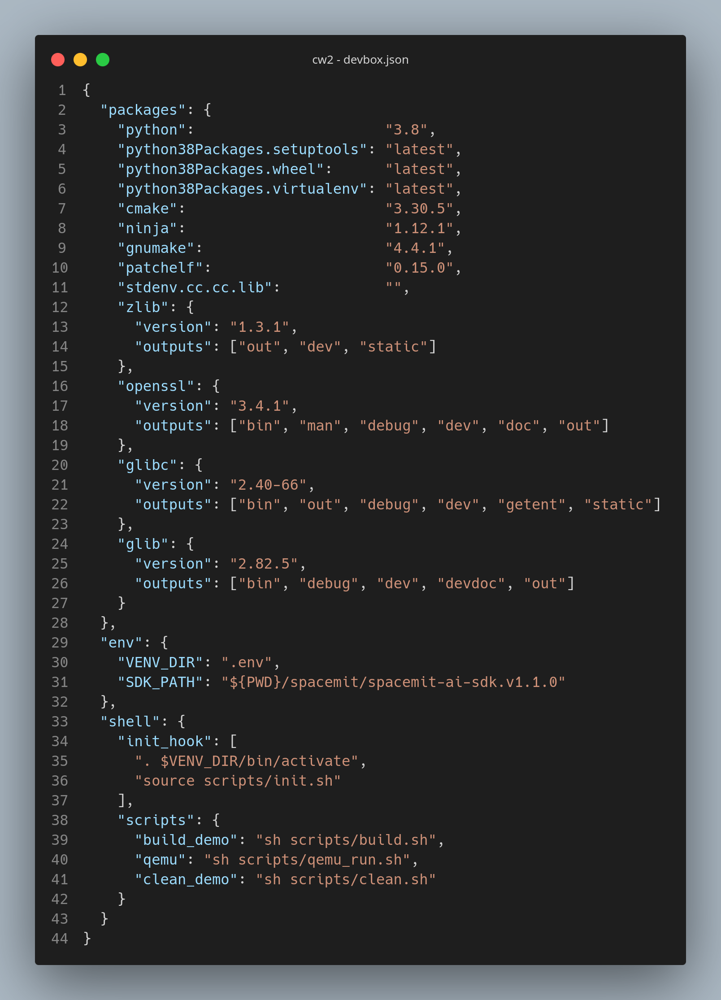

# RISC-V IME Research
Spacemit RISC-V IME 
## Requirements for project  
- For running and managing project dependencies [`devbox`]('https://www.jetify.com/docs/devbox/quickstart/) is used, which supports Linux, MacOS, Windows/WSL2 and NixOS/Nixpkg. 

  It creates isolated environment for project via `devbox.json` which can be reproduced thanks to `devbox.lock` - file with description of needed tools with its versions via hash.  
  <details close><summary>About Devbox</summary>
      <details close><summary>Available Commands</summary>

    ```bash
    devbox shell          # launch shell environment with required tools
    devbox run build-demo # build cmake project
    devbox run clean-demo # clean cmake project
    devbox run qemu       # launch qemu to emulate execution of project 
    ```
    </details>

    <details close><summary>Example of json</summary>

    
    </details>
  </details>

- Install spacemit dependencies (takes some time) via scripts in `scripts/install-spacemit/`
  Minimal list to work with is:
    - `spacemit-ai-sdk.v1.1.0`, 
    - `spacemit-toolchain-linux-glibc-x86_64-v1.0.1`
    ```bash 
    sh scripts/spacemit-install/spacemit-ai-sdk.sh     #install SDK
    sh scripts/spacemit-install/spacemit-toolchain.sh  #install Toolchain
    ```
- Current project structure 
    <details close><summary>tree </summary>

  ```bash 
    📂 2025-riscv-ime-poc
  ├── 📄 CMakeLists.txt
  ├── 📄 devbox.json
  ├── 📄 devbox.lock
  ├── 📂 img
  │   └── 📄 devbox.png
  ├── 📄 old-shell.nix
  ├── 📄 README.md
  ├── 📂 scripts
  │   ├── 🏗 build.sh
  │   ├── 🏗 clean.sh
  │   ├── 🏗 init.sh
  │   ├── 🏗 run-qemu.sh
  │   ├── 🏗 set-env.sh
  │   └── 📂 spacemit-install
  │       ├── 🏗 common.sh
  │       ├── 🏗 spacemit-ai-sdk.sh
  │       └── 🏗 spacemit-toolchain.sh
  ├── 📂 spacemit
  │   ├── 📂 spacemit-ai-sdk.v1.1.0
  │   ├── 📂 spacemit-toolchain-linux-glibc-x86_64-v1.0.1
  │   └── 📂 zips
  │       ├── 📄 spacemit-ai-sdk.v1.1.0.x86_64.tar.gz
  │       ├── 📄 spacemit-toolchain-linux-glibc-x86_64-v1.0.1.tar.xz
  ├── 📂 src
  │   ├── 📂 asm
  │   │   ├── 📂 naive
  │   │   └── 📂 vector
  │   ├── 📂 hpp
  │   │   ├── 📄 matmul.h
  │   │   └── 📄 matrix.h
  │   └── 📄 main.cpp
  └── 📂 tests
      ├── 📄 CMakeLists.txt
      └── 📄 test_matmul.cpp
  ```
  </details>